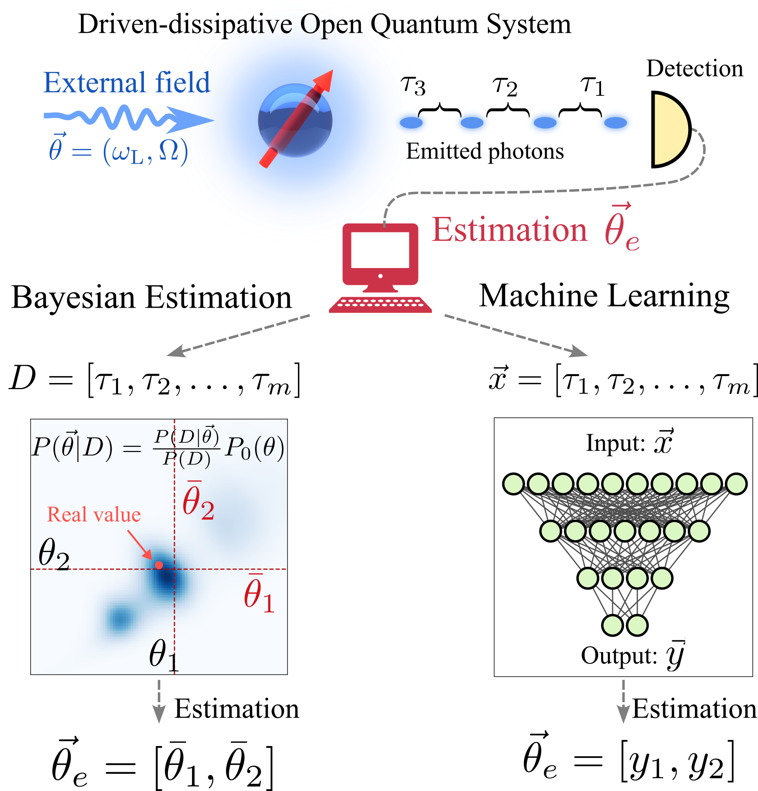

[](https://www.dropbox.com/scl/fi/mkbs1kvn06mvsd5k5v0z9/data.zip?rlkey=k6otygqljpv9aj3bkjp0pjey3&dl=0)

# Parameter Estimation from Photon Counting data with Neural Networks

Parameter estimation via deep learning of quantum correlations in continuous photon counting measurements.
This repository contains [Jupyter](https://jupyter.org/) notebooks with the codes necessary to reproduce the results in the paper <a href = "https://arxiv.org/abs/" target="_blank"> "Parameter estimation by learning quantum correlations in continuous
photon-counting data using neural networks"</a>.

<p align="center">
</p>

Figure 1: Quantum parameter estimation strategies in open quantum systems. Parameters are encoded in the dynamics of an open quantum system: here, the frequency detuning $\Delta = \omega_q-\omega_L$ and amplitude $\Omega$ of an electromagnetic field driving a qubit. The quantum light radiated by the emitter is detected and the photodetection times recorded. The unknown parameters can be reconstructed by application through Bayesian parameter estimation. An alternative approach is based on the use of Neural Networks.

## How to use

### Installation

- Clone this directory
- cd to the current folder `cd ParamEst-NN`
- (Recommended) Create a new Python environment and activate it. For instance, using conda, you can create and activate an environment with name `paramest`, using Python 3.9, as

```shell
conda create -n paramest python=3.9
conda activate paramest
```

- Install the `paramest_nn` as an editable python package with its dependencies

```shell
pip install -e .
```

In Windows you might need to use a package manager such as Anaconda before
installing the `paramest_nn` package.

The details to install conda or a lightweight version called miniconda can be
found below:

- [`conda`](https://docs.conda.io/projects/conda/en/latest/user-guide/getting-started.html)
- [`miniconda`](https://docs.conda.io/en/latest/miniconda.html)

### Populating the ```[datapath]``` folder

At the beginning of each notebook, the path to a directory where data is loaded and written is set as the variable `datapath`.

#### Option #1: Download the data

You can download the necessary content of the ```[datapath]/``` folder in order to reproduce our results in <a href = "https://arxiv.org/abs/" target="_blank"> the paper</a>
from Zenodo at [](https://www.dropbox.com/scl/fi/mkbs1kvn06mvsd5k5v0z9/data.zip?rlkey=k6otygqljpv9aj3bkjp0pjey3&dl=0).

Alternatively, you can directly run the notebooks setting the variable

```python
download_required = True
```

and the data will be downloaded automatically.

#### Option #2: Populate the folder with your own computations

By running the notebooks in this repository, the ```[datapath]/``` folder is populated with training and validation datasets, trained models, and cached results.
These folders have to be populated by running the following notebooks in order:

- [1-Trajectories_generation.ipynb](https://github.com/CarlosSMWolff/ParamEst-NN/blob/main/notebooks/1-Trajectories_generation.ipynb) (populates `[datapath]/training-trajectories` and `[datapath]/validation-trajectories`)
- [2-Training.ipynb](https://github.com/CarlosSMWolff/ParamEst-NN/blob/main/notebooks/2-Training.ipynb) (populates `[datapath]/models`, requires populated `[datapath]/training-trajectories`).
- [3-Results.ipynb](https://github.com/CarlosSMWolff/ParamEst-NN/blob/main/notebooks/3-Results.ipynb) (populates `[datapath]/results-cache`, requires populated `[datapath]/validation-trajectories`, `[datapath]/models`, and `[datapath]/results-cache/bayesian_estimation/2D/estimationBayes2DUltranest`).
**The last folder needs to be populated by running the script `uniform_2d.py` (see instructions below)**

##### Instructions for 2D Ultranest

Obtaining the 2D posterior using Ultranest and post-processing the results are handled by scripts in the [`scripts`](./scripts/) folder.
On a single CPU it can take up to 10 seconds to compute the full posterior with Ultranest for a single trajectory.
Since our validation dataset contains thousands of trajectories for each ground truth pair of parameters, we set up the script [`scripts/uniform_2d.py`](./scripts/uniform_2d.py) to be run on a cluster with multiple nodes (even though the script uses a single core).
The script takes as input an integer corresponding to the index of the pair of ground truth parameters we want to investigate.
Run

```shell
python script/uniform_2d.py --help
```

to see the usage instructions for the code.
The path to the data is hardcoded in the script and the script will work if you have followed the instructions to download the validation data [in the approriate folder](#populating-the-datapath-folder).

To recreate the plots using the notebook [`3-Results.ipynb`](./notebooks/3-Results.ipynb) you would need to run the script above for all parameter pairs (index `0` to `1599`). You will also need to adjust the number of trajectories to use for each parameter set depending on the data files you are using (validation trajectories in batches or not).

The output of running the script is a `CSV` file containing information about the posterior and the maximum likelihood reached during the Ultranest algorithm iterations.
However, for the paper we only use the mean of the posterior as an estimator for the predicted parameters.
The correct files needed to run the 2D prediction section in the notebook [`3-Results.ipynb`](./notebooks/3-Results.ipynb) can be obtained by running

```shell
python script/concat_results.py
```

after adjusting the `idx_data` variable in the script to match the batch of validation trajectories used to create the `CSV` files of the posteriors.

### Running codes in Google Colaboratory

The notebooks are ready to be used in Google Colaboratory, which can be done by pressing  at the top of each notebook.  When running in Colab, data will be downloaded automatically.

**Remark**: The notebook [2-Training.ipynb](https://github.com/CarlosSMWolff/ParamEst-NN/blob/main/notebooks/2-Training.ipynb) is set up to take advantage from Google Colaboratory's TPUs. This is the fastest option for training the models, and it is recommended for readers with access to a Colab Pro account.

## Notebooks

(Currently tested on TensorFlow 2.12.1)

### [1-Trajectories_generation.ipynb](https://github.com/CarlosSMWolff/ParamEst-NN/blob/main/notebooks/1-Trajectories_generation.ipynb)

Generates quantum trajectories for training and validating the neural networks.

### [2-Training.ipynb](https://github.com/CarlosSMWolff/ParamEst-NN/blob/main/notebooks/2-Training.ipynb)

Trains neural networks for the problem of quantum parameter estimation.

### [3-Results.ipynb](https://github.com/CarlosSMWolff/ParamEst-NN/blob/main/notebooks/3-Results.ipynb)

Reproduces the main figures shown in the manuscript, assessing the performance of the trained models.

## Contact  

Feel free to contact me to discuss any issues, questions or comments.

- GitHub: [CarlosSMWolff](https://github.com/CarlosSMWolff)
- Email: [carlossmwolff@gmail.com](carlossmwolff@gmail.com)

### BibTex reference format for citation for the Code

```bibtex
@misc{ParamEstNN,
title={},
url={https://github.com/CarlosSMWolff/ParamEst-NN},
note={GitHub repository containing deep learning approach for quantum parameter estimation with photon counting data.},
author={Enrico Rinaldi, Carlos Sánchez Muñoz},
  year={2023}
}
