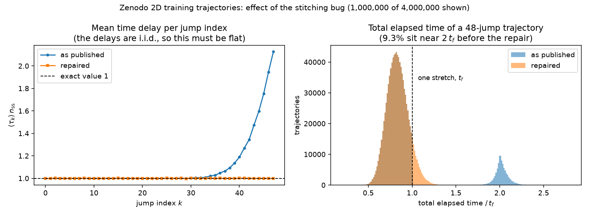

# Repairing the stitching bug in the published training trajectories

The training trajectories published on [Zenodo](https://zenodo.org/record/8305509)
were generated by a version of `QuantumModel.simulateTrajectoryFixedJumps` that
stitched simulated stretches of time together incorrectly. **About 9% of them carry
one spuriously large time delay.**

Nothing was lost when the data was written, so the affected delays can be
recomputed from the published files themselves rather than resimulated.
[`scripts/fix_zenodo_trajectories.py`](../scripts/fix_zenodo_trajectories.py) does
that, and [`tests/test_fix_zenodo_trajectories.py`](../tests/test_fix_zenodo_trajectories.py)
checks the reconstruction against a reproduction of the original simulator.

| | |
| --- | --- |
| **Affected** | `training-trajectories/2D-delta-omega/taus-2D.npy`, `training-trajectories/1D-delta/taus-Delta-1D.npy` |
| **Not affected** | everything under `validation-trajectories/`, and the parameter files |
| **Scale** | 373,137 of 4,000,000 (2D) and 378,387 of 4,000,000 (1D) trajectories, one delay each |
| **Repair** | exact, not statistical: the corrupted delay is recomputed, not resampled |
| **Command** | `python scripts/fix_zenodo_trajectories.py --datapath=data/` |

---

## 1. The bug

`simulateTrajectoryFixedJumps` asks the Monte Carlo solver for a stretch of time
long enough to contain `njumps` jumps on average, with a safety margin:

```
tf = factor * njumps / n_expect          factor = 1.2, njumps = 48
n_expect = <J†J>_ss                      the steady-state photon emission rate
```

That is 57.6 expected jumps for the 48 that are wanted, so most trajectories are
finished by a single stretch. When a stretch fell short, the simulation was
continued from its final state, and the stitching went wrong:

```python
flag = 0
taus_list = []

tshift = t0
while flag == 0:
        sol = mcsolve(H, psi0, tlist, c_ops, [], ntraj=1, ...)

        psi0 = sol.states[-1, 0]
        times = tshift + sol.col_times[0]
        tshift = times[-1]                    # (2)
        taus = list(to_time_delay(times))     # (1)

        taus_list += taus

        if len(taus_list) >= njumpsMC:
            flag = 1

taus = np.array(taus_list)
return taus[:njumpsMC]
```

Two separate mistakes:

1. **`to_time_delay` was applied per stretch.** It reads its first entry as a
   delay measured from zero, which is only true for the very first stretch. The
   opening delay of every continuation was therefore recorded as an *absolute
   time*, not as a delay.
2. **The offset was the last jump, not the stretch length.** `tshift` was
   advanced to `times[-1]` instead of by `tf`, which drops the interval between
   the last jump of a stretch and the end of that stretch.

Both errors land on the same entry, the one at the index where the continuation
begins. Writing `S` for the true absolute time of the last jump of the first
stretch and `c` for the first jump time inside the continuation:

```
recorded  =  S + c                    what the published file holds
correct   =  (tf - S) + c             the delay that should have been written
```

Since `S` is close to `tf`, the recorded value is roughly `2 tf` where a normal
time delay is of order `tf / 57.6` — a delay about a hundred times too long.

## 2. What it did to the published data



**Left.** After each jump a two-level system collapses to its ground state, so the
time delays of a trajectory are i.i.d. and the mean delay cannot depend on the
jump index. As published it climbs to **2.13×** its correct value at index 47,
because the continuation, when it happens, tends to happen near the end.

**Right.** Every jump of the first stretch happened before `tf` by construction,
so an unaffected trajectory's total elapsed time cannot exceed it. The
distribution stops dead at 1.0 and a second population sits near 2.0 — those are
the trajectories carrying a corrupted delay. Nothing at all lies in between.

Read off the first 200,000 trajectories of the 2D set, the edge is exact:

| quantile of (total elapsed time / `tf`) | value |
| --- | --- |
| 0.500 | 0.826878 |
| 0.900 | 0.993946 |
| 0.905 | 0.997980 |
| **0.910** | **1.881268** |
| 0.950 | 2.009089 |
| fraction in (1.0, 1.5) | **0.0000%** |
| fraction above 1.5 | 9.2675% |

The sharpness of that edge is also what confirms the value of `tf` used
throughout: it is reconstructed analytically from the parameters published
alongside each trajectory, and it reproduces `qutip`'s `steadystate` + `expect`
pair to a maximum relative difference of **6.3e-16**.

## 3. Finding the affected delays

The bound above is not a heuristic, it is a property of the simulator: every jump
of stretch `j` happened before `(j + 1) * tf`. So the first cumulative time that
exceeds `(j + 1) * tf` is necessarily a corrupted entry and can be nothing else.

A second, completely independent signature is that a corrupted entry `S + c`
exceeds the entire elapsed time `S` that precedes it — a single waiting time
longer than the sum of all previous ones, which for a healthy trajectory has
probability of order `2^-k` at index `k`. Over the first 500,000 trajectories of
the 2D set, tightening that index threshold makes the second criterion converge on
exactly the same set of rows as the exact bound:

| independent criterion | flagged | disagreements with the exact bound |
| --- | --- | --- |
| delay exceeds elapsed time, index ≥ 15 | 9.3260% | 52 (all false positives of this looser criterion) |
| delay exceeds elapsed time, index ≥ 20 | 9.3168% | 6 |
| delay exceeds elapsed time, index ≥ 25 | 9.3156% | **0 — identical verdict on 100% of rows** |
| the exact `tf` bound | 9.3156% | — |

Two quantities confirm the detection has a wide margin and misses nothing:

| quantity | observed | requirement |
| --- | --- | --- |
| `S / tf` on affected rows | min 0.7048, median 0.9842 | above ~0.5 for the bound to fire |
| recovered `c` | min 8.6e-03, max 0.187 `tf` | must lie in (0, `tf`] to be a jump time |

## 4. The repair

Rearranging the two expressions in §1 gives, for a single continuation,

```
correct = recorded + tf - 2 S
```

with `S` the sum of the delays that precede the corrupted one and `tf` computed
from the trajectory's own parameters. Everything on the right-hand side is known,
so the repair is exact rather than a resampling.

The script implements the general form, which also covers a trajectory continued
more than once, where the offsets compound:

```
correct = (segment_index * tf + c) - S,        c = recorded - tshift
```

The recovered `c` doubles as the guard that makes a second run safe: for a
corrupted delay it is a jump time inside the continuation and lies in `(0, tf]`,
whereas re-reading an already repaired delay yields a negative `c`. Those rows are
left alone and reported, so running the script twice is a no-op instead of a
disaster.

**In practice, no trajectory needed more than one continuation.** Across all
8,000,000 published trajectories, the count of rows with two or more was zero.

## 5. Evidence that the repair is right

### Round-trip against a reproduction of the simulator

The published random numbers are gone, so the repaired trajectories cannot be
compared with a ground truth. What can be compared is the repair itself:
[the tests](../tests/test_fix_zenodo_trajectories.py) reproduce *both* the buggy
and the correct stitching from the same synthetic jump times, and require the
repair to turn one into the other exactly.

| test | what it pins down |
| --- | --- |
| `test_single_continuation_is_repaired_exactly` | the common case, bit-exact over 200 random parameter pairs |
| `test_two_continuations_are_repaired_exactly` | the rare case where the offsets compound |
| `test_unaffected_trajectories_are_left_alone` | a trajectory finished in one stretch is not modified at all |
| `test_mixed_batch_is_repaired_row_by_row` | 0, 1 and 2 continuations repaired together in one array |
| `test_repair_is_idempotent` | a second run changes nothing and says so |
| `test_repaired_delays_are_positive_and_within_a_stretch` | repaired delays stay physical |
| `test_steady_state_rate_matches_compute_population_ss` | the closed form for `tf` is the package's own |

### Statistical checks on the real data

Checks against references the repair never saw:

| check | as published | repaired | reference |
| --- | --- | --- | --- |
| mean (total elapsed / `tf`), 2D | 0.922102 — **10.65% off** | 0.833155 — **0.021% off** | exactly `1/factor` = 0.833333 |
| mean (total elapsed / `tf`), 1D | 0.923348 — **10.80% off** | 0.833140 — **0.023% off** | exactly `1/factor` = 0.833333 |
| worst per-index mean delay | **2.134** at index 47 | 0.9994 | 1.0 for every index |
| largest total elapsed / `tf`, 2D | **2.638** | 1.653 | at most 2, the stretches available |
| largest total elapsed / `tf`, 1D | **2.730** | 1.736 | at most 2, the stretches available |
| rows whose total exceeds every stretch the simulator ran | 229,673 (2D), 232,507 (1D) | **0** | 0 |

The first two rows are an exact, parameter-free target: for a renewal process the
mean delay is `1 / n_expect`, so 48 delays average to `48 / n_expect = tf / factor`.
The last three say the same thing in the strongest possible form — as published,
a quarter of a million trajectories describe more elapsed time than the simulator
ever integrated for them, which no amount of statistical bad luck can produce.

The per-index mean, over the first 2,000,000 trajectories of the 2D set:

| jump index | as published | repaired |
| --- | --- | --- |
| 0 | 0.9989 | 0.9989 |
| 20 | 0.9995 | 0.9995 |
| 30 | 1.0031 | 1.0007 |
| 38 | 1.0947 | 1.0005 |
| 42 | 1.3501 | 0.9996 |
| 44 | 1.5942 | 0.9990 |
| 46 | 1.9456 | 0.9997 |
| 47 | **2.1341** | 0.9994 |
| **worst deviation from 1.0** | **1.1341** | **0.0017** |

And a two-sample Kolmogorov–Smirnov test with full statistics. Since the delays
are i.i.d., the delay at any index — rescaled by the trajectory's own rate to
remove the parameter dependence — must follow the same distribution as the delay
at index 20, which neither the bug nor the repair touches:

| jump index | KS as published | KS repaired |
| --- | --- | --- |
| 30 | 0.00085 | 0.00084 |
| 40 | 0.00354 | 0.00100 |
| 44 | **0.01083** | 0.00070 |
| 46 | **0.01718** | 0.00126 |
| 47 | **0.02059** | 0.00056 |
| *control:* index 10 vs index 20 | 0.00062 | — |

with 2,000,000 samples per side and a 95% critical value of **0.00136**. As
published, index 47 is rejected at 15× the critical value; after the repair every
index sits at the level of the control.

For completeness, the pooled delays were also compared with the analytic
waiting-time distribution `compute_waiting_time` in narrow parameter bins. The
repaired data is consistent with it everywhere, but the test is not discriminating
at that sample size — the corrupted entries are only ~0.2% of a pooled bin, so the
"as published" column passes too:

| Δ | Ω | pooled delays | KS as published | KS repaired | 95% critical |
| --- | --- | --- | --- | --- | --- |
| 0.30 | 0.50 | 10,896 | 0.00726 | 0.00726 | 0.01303 |
| 1.00 | 1.00 | 10,512 | 0.01308 | 0.01308 | 0.01326 |
| 1.50 | 2.50 | 10,656 | 0.00465 | 0.00451 | 0.01317 |
| 2.50 | 4.00 | 11,280 | 0.00735 | 0.00779 | 0.01281 |
| 0.10 | 4.50 | 9,600 | 0.00663 | 0.00684 | 0.01388 |

The per-index mean and the two-sample test above are the sharp ones.

## 6. Scope

| dataset | affected | why |
| --- | --- | --- |
| `training-trajectories/2D-delta-omega/taus-2D.npy` | **yes**, 373,137 rows (9.3284%) | generated by `simulateTrajectoryFixedJumps` |
| `training-trajectories/1D-delta/taus-Delta-1D.npy` | **yes**, 378,387 rows (9.4597%) | generated by `simulateTrajectoryFixedJumps` |
| `validation-trajectories/**` | **no** | generated by a different loop in `1-Trajectories_generation.ipynb`, which restarts every continuation from the ground state instead of stitching stretches together |
| `param_rand_list-2D.npy`, `delta_rand_list-Delta-1D.npy` | **no** | drawn from the prior, never passed through the simulator |

The verdict on the validation sets rests on reading the generating loop, not on
inspecting the files: the 11.6 GB archive was not downloaded. That loop restarts
every round from the ground state at `t = 0` and converts each round to delays on
its own, so the opening delay of a continuation is a genuine waiting time measured
from a reset — neither mistake of §1 can occur in it, and no delay is inflated.

It is worth noting separately, though, that the same loop **discards the residual
interval** between the last jump of a round and the end of that round. The delay
that straddles a round boundary is therefore too *short* by that residual, where
the training bug made it too long. This is a much milder effect — the residual is
of the order of one mean waiting time, not of `tf` — and it is a different issue
from the one this page is about, so nothing here corrects it. It would show up as
a per-index mean sitting slightly *below* 1.0 near the end of the trajectory, the
mirror image of the left-hand panel in §2; that check is the way to settle it on
the actual files.

Exactly one delay changed per affected trajectory: 373,137 delays out of
192,000,000 in the 2D set (**0.1943%**) and 378,387 out of 192,000,000 in the 1D
set (**0.1971%**). The continuation started at index 47 most often and at index 45
on median, ranging down to index 23 in the 2D set and index 20 in the 1D set — so
the corrupted delay always falls inside the 48 that were kept.

## 7. Running it

```bash
python scripts/fix_zenodo_trajectories.py --datapath=data/
```

Repairs both training sets in place and keeps the files as published beside them
under the suffix `.zenodo-orig.npy`. Useful flags:

| flag | effect |
| --- | --- |
| `--dry_run` | report what would change, write nothing |
| `--dataset=2d` / `--dataset=1d` | process only one of the two sets |
| `--outdir=...` | write the repaired files elsewhere instead of in place |
| `--factor`, `--gamma` | override the simulator settings the data was generated with |

The script needs only `numpy` and `fire`, so the `torch-sbi` environment of
[`environment-sbi.yml`](../environment-sbi.yml) runs it, as well as the tests and
the figure of this page:

```bash
python tests/test_fix_zenodo_trajectories.py
python docs/make_figures.py --datapath=data/
```

## 8. What this means for downstream results

Trajectories generated now, with the fixed simulator, will differ from the
published ones — the repaired files are what the fixed simulator would have
produced from the same random numbers. Any model trained on the trajectories as
published saw a 9% contamination of one very long delay each, concentrated in the
last few jumps of the trajectory, so results obtained from them are worth
re-checking against the repaired data.
